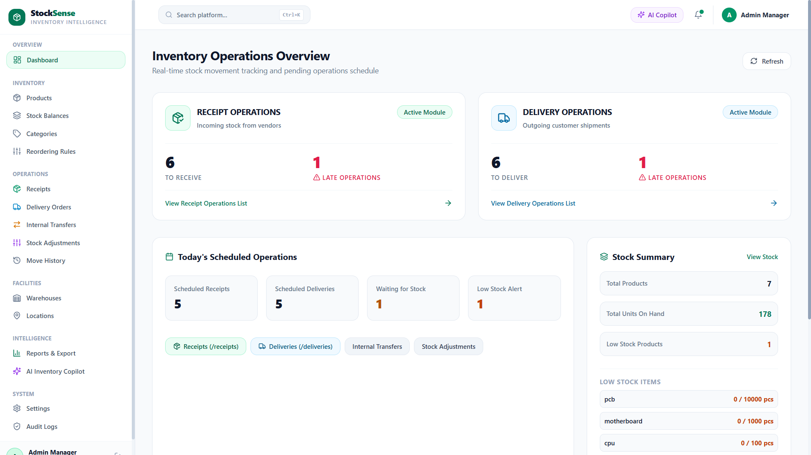
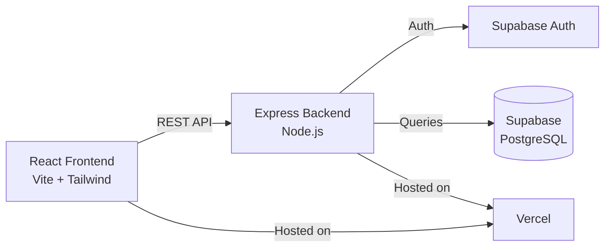

# 📦 StockSense


**Centralized Inventory Management System** — real-time tracking of products, warehouses, receipts, deliveries, transfers, and stock adjustments.

🔗 **Live App:** [stocksense-odoo.vercel.app](https://stocksense-odoo.vercel.app)
🏆 **Built for:** Odoo × GCET Hyderabad Hackathon 2026

---

## Table of Contents

1. [Overview](#overview)
2. [Features](#features)
3. [Screenshots](#screenshots)
4. [Tech Stack](#tech-stack)
5. [Project Structure](#project-structure)
6. [Getting Started](#getting-started)
7. [Demo Login Credentials](#-demo-login-credentials)
8. [Team](#team)

---

## Overview

StockSense replaces manual registers, spreadsheets, and scattered stock tracking with a single centralized platform. It gives **Inventory Managers** and **Warehouse Staff** real-time visibility into every product, every location, and every stock movement — from vendor receipt to final delivery.

**Core data flow:**

```
Products → Warehouses → Locations → Inventory Operations → Stock → Movement History
```

---

## Features

### Core Operations
- **Receipts** — record incoming stock from vendors
- **Delivery Orders** — pick, pack, and ship outgoing stock
- **Internal Transfers** — move stock between racks, floors, or warehouses
- **Stock Adjustments** — reconcile system stock with physical counts
- **Move History** — complete, timestamped ledger of every stock event

### Catalog & Setup
- **Products** — create/update products, categories, units of measure
- **Reordering Rules** — automated low-stock reorder thresholds
- **Warehouses & Locations** — multi-warehouse, multi-location tracking

### Visibility & Insights
- **Dashboard** — real-time KPIs and operations overview
- **Reports** — inventory summaries and analytics
- **Audit Logs** — user and system activity tracking
- **Notifications** — low-stock and operational alerts
- **Global Search** — quickly find products, orders, and records

### Platform
- **Authentication** — signup, login, forgot/reset password
- **AI Copilot** — AI assistant for inventory queries

---

## Screenshots

| Dashboard | Receipts |
|---|---|
|  |  |

| Delivery Orders | Move History |
|---|---|
|  |  |

> Add screenshots to `docs/screenshots/` with the filenames above to display them here.

---

## Tech Stack

| Layer | Technology |
|---|---|
| Frontend | React.js + Vite |
| UI / Styling | Tailwind CSS |
| Backend | Node.js + Express.js |
| Database | PostgreSQL |
| Backend Database Platform | Supabase |
| Authentication | Supabase Auth |
| API | REST APIs |
| Deployment | Vercel |
| Version Control | Git + GitHub |
| Security | Helmet, rate limiting, role-based authorization |
| Data Export | CSV reports |

**Architecture:**



---

## Project Structure


```
StockSense/
├── frontend/              React + Vite client
│   └── src/
│       ├── pages/         Route-level views (Dashboard, Receipts, Deliveries, ...)
│       ├── components/    Shared UI (Navbar, Sidebar, Modals)
│       ├── context/       App-wide state
│       └── services/      API clients
│
├── backend/               Express server
│   ├── routes/            REST endpoints per module
│   ├── middleware/        Auth & security
│   ├── services/          Business logic (stock, security monitoring)
│   ├── config/            DB & Supabase config
│   └── scripts/           DB init, seed, verification
│
├── api/                   Vercel serverless entry point
├── supabase/               Database migrations
└── vercel.json             Deployment config
```

---

## Getting Started


### Prerequisites
- Node.js (v18+)
- A [Supabase](https://supabase.com) project (Postgres + Auth)

### 1. Clone the repo
```bash
git clone https://github.com/<your-org>/StockSense.git
cd StockSense
```

### 2. Backend setup
```bash
cd backend
npm install
cp .env.example .env   # add your Supabase credentials
npm run init-db        # initialize database schema
npm run seed           # optional: seed sample data
npm run dev
```

### 3. Frontend setup
```bash
cd frontend
npm install
cp .env.example .env   # add your API/Supabase config
npm run dev
```

The frontend runs on Vite's default dev port; the backend serves the REST API consumed by the client.

---

## 🔐 Demo Login Credentials

StockSense provides role-based access for three types of users. The following accounts are available for the hackathon demonstration.

| Role | Email | Password |
|------|-------|----------|
| 👑 **Admin** | `admin@stocksense.demo` | `Admin@12345` |
| 📦 **Inventory Manager** | `manager@stocksense.demo` | `Manager@12345` |
| 🏭 **Warehouse Staff** | `staff@stocksense.demo` | `Staff@12345` |

### 👑 Admin

**Email:** `admin@stocksense.demo`
**Password:** `Admin@12345`

Provides full system access, including:

- Dashboard
- Products
- Stock
- Categories
- Reordering Rules
- Receipts
- Delivery Orders
- Internal Transfers
- Inventory Adjustments
- Move History
- Warehouses & Locations
- Reports
- AI Copilot
- User Management
- Audit Logs
- Security Monitor
- Settings
- Profile

### 📦 Inventory Manager

**Email:** `manager@stocksense.demo`
**Password:** `Manager@12345`

Provides inventory management access, including:

- Dashboard
- Products
- Stock
- Categories
- Reordering Rules
- Receipts
- Delivery Orders
- Internal Transfers
- Inventory Adjustments
- Move History
- Warehouses & Locations
- Reports
- AI Copilot
- Settings
- Profile

Admin-only functions are protected by role-based authorization.

### 🏭 Warehouse Staff

**Email:** `staff@stocksense.demo`
**Password:** `Staff@12345`

Provides warehouse-focused operational access, including:

- Dashboard
- Stock
- Receipts
- Delivery Orders
- Internal Transfers
- Move History
- Reports
- AI Copilot
- Profile

Administrative functions and restricted APIs are protected from Warehouse Staff users.

> **Demo accounts:** These credentials are intended only for the hackathon demonstration environment. Do not use them for a production deployment.

---

## Team

**CodeForIndia** · Karpagam College of Engineering

| Name | Roll No. | Role |
|---|---|---|
| Pranav R K | 71725P139 |  |
| Cibi K | 71725F112 |  |
| Sriram G S | 71725F152 |  |
